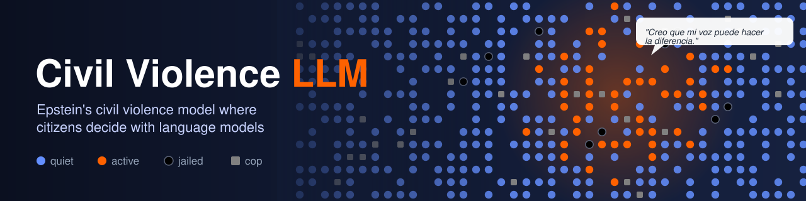

# Civil Violence LLM

[](https://github.com/lrufiner/Civil_Violence_LLM/actions/workflows/tests.yml)
[](https://www.python.org/)
[](https://mesa.readthedocs.io/)
[](LICENSE)



Epstein's civil violence model where citizens can decide whether to rebel using a Large Language Model (LLM).

## What is it?

This project implements Model 1 from "Modeling civil violence: An agent-based computational approach" by Joshua Epstein ([PNAS, 2002](https://www.pnas.org/content/99/suppl_3/7243.full)) on a grid of agents:

- **Citizens** feel a grievance against the government and decide each turn whether to rebel (🟠 active) or stay quiet (🔵), weighing how many cops and rebels they see. Arrested citizens (⚫) spend some turns in jail.
- **Cops** arrest one visible rebel per turn.

The twist is *who decides* for each citizen. You can choose between:

| Engine | What it does | Needs |
|---|---|---|
| `regla` (rule) | Epstein's original formula | nothing |
| `llm` | A chat model (Ollama, OpenAI or Anthropic Claude) reads the citizen's situation and answers with a decision and a short justification | Ollama running locally, or an API key |
| `jev` | The [Jev](https://typesafe.ai/) decision model returns a probability of rebelling and the factor that weighed most | a TypeSafe API key |
| `híbrido` (default) | Most citizens use the rule; a small fraction (3%) uses the LLM or Jev | whatever that engine needs |

The web interface (Spanish by default, English optional) shows the map, the evolution over time, and the justifications of the LLM/Jev citizens. Its **Cómo funciona** tab explains the formulas.

## Demo video

A typical run, narrated in Spanish (2 min): the hybrid engine with Jev, an outburst after lowering legitimacy live, and the citizens' justifications.

[](https://youtu.be/sIutYg9dJAo)

## Quick start

Requires Python 3.11+.

```bash
git clone https://github.com/lrufiner/Civil_Violence_LLM.git
cd Civil_Violence_LLM
python3.11 -m venv .venv
source .venv/bin/activate      # Windows: .venv\Scripts\activate
pip install -r requirements.txt
```

Optional, depending on the engine you want to use:

- **Ollama (free, local)**: install it from [ollama.ai](https://ollama.ai/) and run `ollama pull phi3`.
- **OpenAI / Anthropic / Jev**: `cp .env.example .env` and fill in `OPENAI_API_KEY`, `ANTHROPIC_API_KEY` or `TYPESAFE_API_KEY`. Never commit real keys.

Without either, choose the `regla` engine in the interface: it works with no external dependency.

## Run the simulation

```bash
# Linux/Mac
.venv/bin/python -m solara run app.py
# Windows
.venv\Scripts\python.exe -m solara run app.py
```

Open `http://localhost:8765`, pick the parameters and the decision engine in the left panel, press **Reiniciar**, then **▶** (play) or **Paso** (one step). Legitimacy, vision, jail term and the rebellion rule can be changed live with the *Ajustes en vivo* sliders.

To change the default engine, language or other settings, edit `config.py` (see [CONFIG_GUIDE.md](CONFIG_GUIDE.md)).

## Run tests

```bash
pytest
```

The tests use mocks: they make no real API calls and cost nothing.

## More documentation

- [TECHNICAL.md](TECHNICAL.md): architecture diagrams, how each engine decides, all parameters, interface details, performance, engine comparison and troubleshooting.
- [CONFIG_GUIDE.md](CONFIG_GUIDE.md) (Spanish): every configuration option.

## Contributing

Issues and pull requests are welcome. Please run `pytest` before submitting; CI runs the same suite on every push.

## Credits

Based on: Epstein, J. M. (2002). "Modeling civil violence: An agent-based computational approach". *Proceedings of the National Academy of Sciences*, 99(suppl 3), 7243-7250.

## License

MIT. See [LICENSE](LICENSE). If you use this software in academic work, please cite it (see [CITATION.cff](CITATION.cff)).

## Authors

Juan Aued & Leonardo Rufiner
