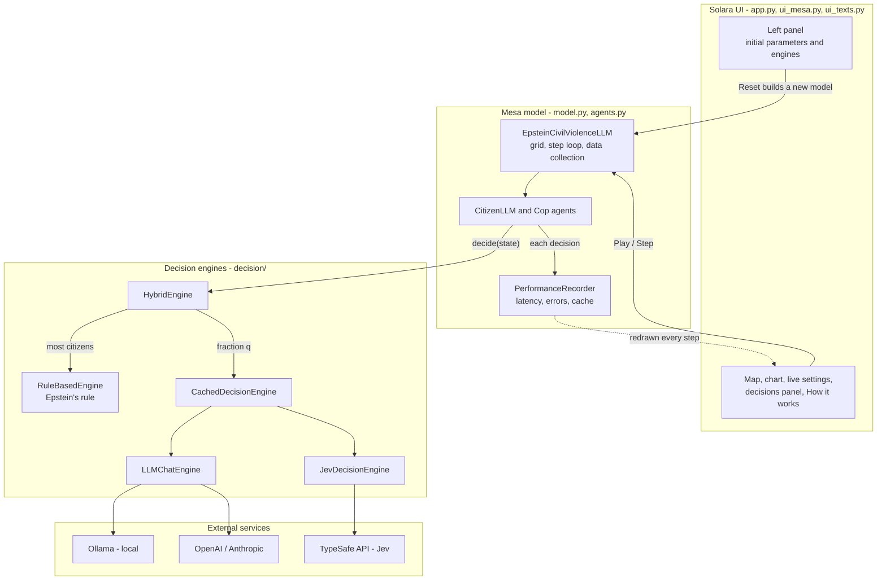
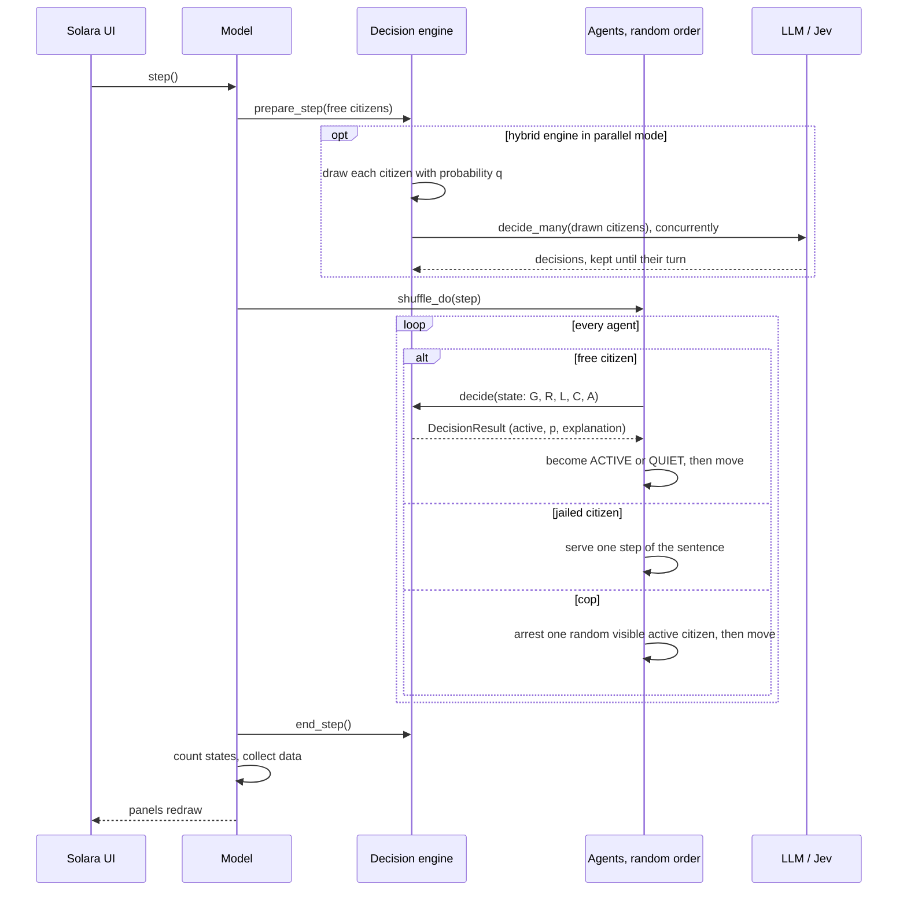
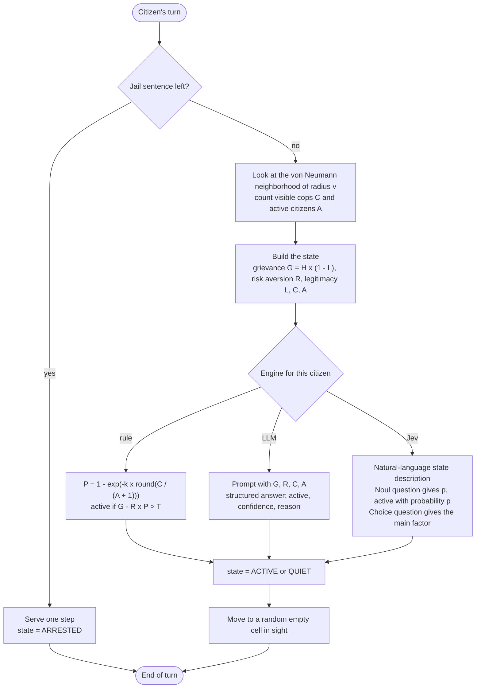
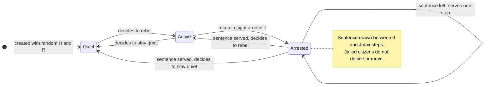
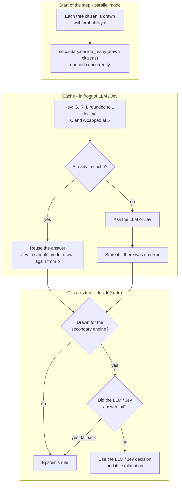

# Civil Violence LLM — Technical details

Complement to the [README](README.md): architecture, how citizens decide, every parameter, the interface, performance and troubleshooting. For every configuration option see [CONFIG_GUIDE.md](CONFIG_GUIDE.md).

## Contents

- [Architecture](#architecture)
- [Project structure](#project-structure)
- [How citizens decide](#how-citizens-decide)
- [Model parameters](#model-parameters)
- [Interface controls](#interface-controls)
- [Performance](#performance)
- [Comparing decision engines](#comparing-decision-engines)
- [Troubleshooting](#troubleshooting)
- [Technologies used](#technologies-used)

## Architecture



The data pipeline stores per-step counts of quiet/active/jailed citizens and decision-engine call/error/latency stats, plus per-agent inputs, responses and explanations for downstream analysis.

## Project structure

```text
Civil_Violence_LLM/
├── agents.py              # Citizen and Cop agents; citizens delegate the rebellion decision
├── model.py               # Simulation model; builds and syncs the decision engine
├── app.py                 # Solara interface (panels, layout, labels)
├── ui_mesa.py             # Translates Mesa's built-in UI texts and replaces its panel grid
├── ui_texts.py            # Every UI text in Spanish and English, incl. the "How it works" tab
├── config.py              # Centralized configuration (model, decision engine, logging)
├── decision/              # Pluggable decision engines
│   ├── types.py           # CitizenDecisionState, DecisionResult, RebellionDecision
│   ├── base.py            # DecisionEngine interface
│   ├── rule_based.py      # Epstein's rule (real arrest probability)
│   ├── llm_chat.py        # OpenAI / Anthropic / Ollama via LangChain (structured output)
│   ├── jev.py             # Jev (TypeSafe AI System One) via langchain-typesafe
│   ├── hybrid.py          # Mixes a primary and a secondary engine
│   ├── cache.py           # Caches decisions for equivalent states (LLM/Jev)
│   └── factory.py         # build_engine(kind, **kwargs)
├── llm/
│   └── providers.py       # get_chat_model(provider, model, ...) LangChain factory
├── metrics/
│   ├── collector.py       # PerformanceRecorder (latency, errors, cache per decision)
│   └── report.py          # Generates comparison_report.md and charts
├── experiments/
│   ├── configs.py         # Engine presets for comparison runs
│   ├── run_comparison.py  # CLI: runs each engine and builds the report
│   └── compare_report.ipynb  # Interactive exploration notebook
├── tests/                 # pytest suite (decision engines mocked, collector, model, UI)
├── assets/banner.svg      # README banner
├── .github/workflows/     # CI: runs the test suite on every push and pull request
├── .env.example           # Template for the OPENAI / ANTHROPIC / TYPESAFE API keys
├── requirements.txt       # Python dependencies
├── README.md              # Overview and quick start
├── TECHNICAL.md           # This file
├── CONFIG_GUIDE.md        # Configuration guide (Spanish)
├── CITATION.cff           # How to cite this software
└── LICENSE                # MIT
```

## How citizens decide

The same explanation, with rendered formulas, is available in the app's **How it works** tab.

### One simulation step



### A citizen's turn



### Epstein's rule (Model 1)

Each citizen draws two fixed traits at creation: hardship $H \sim U(0,1)$ and risk aversion $R \sim U(0,1)$. Government legitimacy $L$ is shared by everyone.

| Quantity | Formula | UI control |
|---|---|---|
| Grievance | $G = H\,(1 - L)$ | Government legitimacy ($L$) |
| Estimated arrest probability | $P = 1 - \exp\left(-k \cdot \mathrm{round}\left(C_v / (A_v + 1)\right)\right)$ | Arrest risk constant ($k$) |
| Net risk | $N = R \cdot P$ | — |
| Rebellion rule | active if $G - N > T$, otherwise quiet | Rebellion threshold ($T$) |

- $C_v$ and $A_v$ are the cops and active citizens within the citizen's von Neumann neighborhood of radius $v$ (citizen vision); the $+1$ counts the citizen themselves.
- The rounding is not in the paper, but Mesa's reference implementation uses it because the published dynamics cannot be reproduced without it: with fewer than half as many cops as active citizens in sight, the perceived risk drops to 0.
- Cops arrest one random active citizen in their vision each step; the sentence is drawn between $0$ and $J_{max}$ steps. Jailed citizens do not decide.
- After acting, every free agent (citizen or cop) moves to a random empty cell within its vision. The grid is a torus, and each step all agents act one by one in a random order (`MODEL_PARAMS["activation_order"] = "random"`).
- **Rule mode reproduces Mesa's reference implementation of Epstein's Model 1 exactly**: with the same seed and parameters, every agent has the same position and state at every step. `tests/test_epstein_equivalence.py` checks this against `mesa.examples.advanced.epstein_civil_violence`. The only intentional difference is that citizens use *citizen vision* for their neighborhood, while Mesa's example uses the cop vision for everyone (the test uses equal visions).

Citizen states over time:



### LLM engine

The citizen describes its situation to a chat model with a prompt containing $G$ (%), $R$ (%), $C_v$ and $A_v$; it does **not** receive $L$, $P$, $k$ or $T$. The model must answer with a structured object — `active`, `confidence` (0–1) and `reason` (a first-person justification of up to 15 words, in the UI language). The decision is `active`; the reported probability is `confidence` if the citizen rebels and `1 - confidence` otherwise. Temperature is 0.

### Jev engine

Jev receives a natural-language description of the state — $G$, $R$ and $L$ as percentages, whether the grievance is low, moderate or high, $C_v$ and $A_v$ together with the number of cells in sight (for scale), the resulting rebels-per-cop ratio, and the fact that each cop arrests one rebel per turn, but not Epstein's formula or threshold — and answers two typed questions in one request: a yes/no `Noul` question that returns a calibrated probability $p$ of rebelling (in `sample` mode the citizen rebels with probability $p$, drawn with the model's seed; in `threshold` mode if $p \ge 0.5$), and a `Choice` question about which factor weighs most (grievance, fear of the police, contagion from active citizens or legitimacy). The factor is only shown as an explanation and does not affect the decision.

### Hybrid mode

Each step, each free citizen uses the secondary engine (LLM or Jev) with probability $q$ (default 3%) and the rule otherwise. With `parallel_secondary=True` those citizens are queried together at the start of the step, so they decide with their start-of-step neighborhood. If the secondary engine fails, that citizen falls back to the rule.



## Model parameters

### Initial Parameters (require restart)

- **`citizen_density`**: Initial citizen density (0-1)
- **`cop_density`**: Initial cop density (0-1)
- **`height/width`**: Grid dimensions

### Dynamic Parameters (update in real-time)

- **`legitimacy`**: Government legitimacy perception (0-1)
  - Low values = high grievance = more rebellion
  - High values = low grievance = less rebellion
- **`citizen_vision`**: Citizen vision radius (cells)
- **`cop_vision`**: Cop vision radius (cells)
- **`max_jail_term`**: Maximum jail sentence
- **`active_threshold`**: Rebellion threshold used by the rule-based engine
- **`arrest_prob_constant`** (k): Constant in `P = 1 - exp(-k * round(C / (A + 1)))` (see [Epstein's rule](#epsteins-rule-model-1))

### Decision Engine Configuration (in config.py)

`DECISION_ENGINE_CONFIG["kind"]` selects the engine family:

- **`"rule"`**: pure mathematical rule (fast, deterministic, zero cost/dependencies)
- **`"llm"`**: chat LLM via LangChain — set `DECISION_ENGINE_CONFIG["llm"]["provider"]` to `"ollama"`, `"openai"` or `"anthropic"`, and `["model"]` to the model name
- **`"jev"`**: Jev (TypeSafe AI System One) — set `DECISION_ENGINE_CONFIG["jev"]["model"]`
- **`"hybrid"`** (default): mixes a `primary` (rule) and `secondary` (llm/jev) engine; `DECISION_ENGINE_CONFIG["hybrid"]["secondary_rate"]` controls the fraction of agents using the secondary engine (default 3%, same as the original behavior). With `parallel_secondary=True` (default) those agents are queried in parallel at the start of each step, so they decide with their start-of-step neighborhood; set it to `False` for the original one-by-one asynchronous activation

Costly engines (`llm`/`jev`) are cached by default (`DECISION_ENGINE_CONFIG["cache"]`): states are rounded to one decimal and visible counts are capped at 5, so repeated equivalent states don't trigger repeated API calls. For Jev in `sample` mode the probability is cached and each hit samples again.

`DECISION_ENGINE_CONFIG["jev"]["explain"]` (default `True`) adds a second typed question to each Jev request, asking which factor weighed most; it costs ~40 ms per request. See [CONFIG_GUIDE.md](CONFIG_GUIDE.md) for every option.

## Interface controls

The interface language is set with `UI_LANGUAGE` in `config.py` (`"es"` by default, or `"en"`), or with the `UI_LANGUAGE` environment variable. It also sets the language of the LLM's justifications. The names below are the Spanish ones; Mesa's built-in texts (buttons, panel titles) are translated by `ui_mesa.py`. The main view has two tabs: **Simulación** and **Cómo funciona** (formulas and how each engine decides).

### Sidebar: initial parameters (apply on **Reiniciar**)

- Semilla aleatoria, densidad inicial de ciudadanos y de policías, visión de ciudadanos y policías
- Legitimidad del gobierno, condena máxima, umbral de rebelión, constante de riesgo de arresto (k)
- **Motor de decisión**: `híbrido` | `regla` | `llm` | `jev`
- **Motor secundario** (hybrid only): `llm` | `jev`, and **Fracción al motor secundario**
- **Proveedor LLM**: `ollama` | `openai` | `anthropic`

The **Controles** card holds **Reiniciar**, **▶** (play/pause) and **Paso** (one step).

### Main area

- **Acerca de esta simulación**: a two-paragraph description of the model and how to use the app
- **Map**: 🔵 quiet, 🟠 active, ⚫ jailed citizens; gray cops
- **Chart**: quiet / active / jailed citizens per step
- **Ajustes en vivo (sin reiniciar)**: legitimacy, citizen and cop vision, max jail term, rebellion threshold and k, applied immediately
- **Decisiones de los ciudadanos**:
  - *Desempeño por motor*: decisions, cache hit rate, errors and mean latency for each engine (rule and LLM/Jev separately)
  - *Últimas justificaciones*: the latest LLM/Jev decisions of the current step with their explanation, e.g. `“Creo que mi voz puede hacer la diferencia…”` (LLM) or `p(rebelión)=0.10 · factor: miedo a la policía (85%)` (Jev)

### Console Output

Monitor non-rule decisions in the terminal:

```text
💭 Agent 123 | llm:ollama:phi3 | active=True p=0.85 | Creo que mi voz puede hacer la diferencia.
⚡ Agent 456 | jev:jev-latest | active=False p=0.10 | p(rebelión)=0.10 · factor: miedo a la policía (85%)
```

## Performance

The simulation supports a **hybrid approach** for performance:

- **P% of agents** use the costly secondary engine (LLM/Jev) for decisions
- **100-P% of agents** use the mathematical rule (near-instant)
- The secondary decisions of each step are requested **in parallel** (up to `max_concurrency` at once: 16 for Jev, 4 for LLMs)
- Costly decisions are cached for equivalent states, further cutting API calls

Measured with the default 40×40 grid and 3% secondary rate:

| Secondary engine | Per request | Per step |
|---|---|---|
| Jev (TypeSafe API) | ~290 ms (~240 ms is network round-trip) | ~0.4 s after the first step |
| Ollama `phi3` (local) | ~1.6 s | ~6–10 s |

Pure `jev` or `llm` mode (every citizen queries the provider sequentially) takes minutes per step and is meant for small grids or offline comparisons.

To adjust the fraction, use the **Fracción al motor secundario** slider or edit `config.py`:

```python
DECISION_ENGINE_CONFIG["hybrid"]["secondary_rate"] = 0.05  # 5% instead of 3%
```

See `results/comparison_report.md` (generated by `experiments/run_comparison.py`) for measured latency/cost/error-rate per engine.

### Run in background

```bash
nohup .venv/bin/python -m solara run app.py > solara.log 2>&1 &
```

## Comparing decision engines

```bash
python -m experiments.run_comparison --engines rule ollama openai anthropic jev --steps 30 --seeds 1 2 3
```

This runs small simulations with each engine, records latency/error/cost metrics, and writes `results/comparison_report.md` (+ PNG charts) comparing them. `paid` engines (`openai`/`anthropic`/`jev`) need their API key in `.env`; omit them from `--engines` if you don't have one. Explore the same data interactively in [experiments/compare_report.ipynb](experiments/compare_report.ipynb).

## Troubleshooting

- **`AttributeError: module 'reacton.ipyvuetify' has no attribute 'TabsItems'`**: Solara is running on a Python with Mesa < 3.5 and `ipyvuetify` 3. Start the app with the virtual environment's Python (see [Run the simulation](README.md#run-the-simulation)).
- **No justifications in the UI**: the `regla` engine produces no text. Choose `híbrido` with secondary `llm` or `jev` (or pure `llm`/`jev`), press **Reiniciar**, then **▶** or **Paso**.
- **Changed the engine in the sidebar but the old one keeps running**: sidebar parameters (engines included) only apply on **Reiniciar**. While changes are pending, the *Decisiones de los ciudadanos* panel shows a warning listing them. Each browser tab runs its own model, so reloading the page starts from the defaults in `config.py`.
- **Jev takes minutes per step**: you are using pure `jev`; use `híbrido` with secondary `jev` instead.
- **Ollama connection errors**: make sure `ollama serve` is running and the model is pulled (`ollama pull phi3`). A failing secondary engine falls back to the rule for that citizen, and the error is counted in *Desempeño por motor*.

## Technologies used

- [Mesa](https://mesa.readthedocs.io/) - Agent-based modeling framework
- [Solara](https://solara.dev/) - Reactive web visualization framework
- [LangChain](https://python.langchain.com/) - Provider-agnostic LLM orchestration (OpenAI, Anthropic, Ollama)
- [Ollama](https://ollama.ai/) - Local LLM engine
- [Jev / TypeSafe AI](https://typesafe.ai/) - "System One" typed decision model
- [Pydantic](https://docs.pydantic.dev/) - Structured LLM output schemas
- [Matplotlib](https://matplotlib.org/) - Data visualization
- [NetworkX](https://networkx.org/) - Network analysis
- [pytest](https://pytest.org/) - Unit testing
